# Scalable Web Architecture on AWS (ALB + Auto Scaling)

## アーキテクチャ図

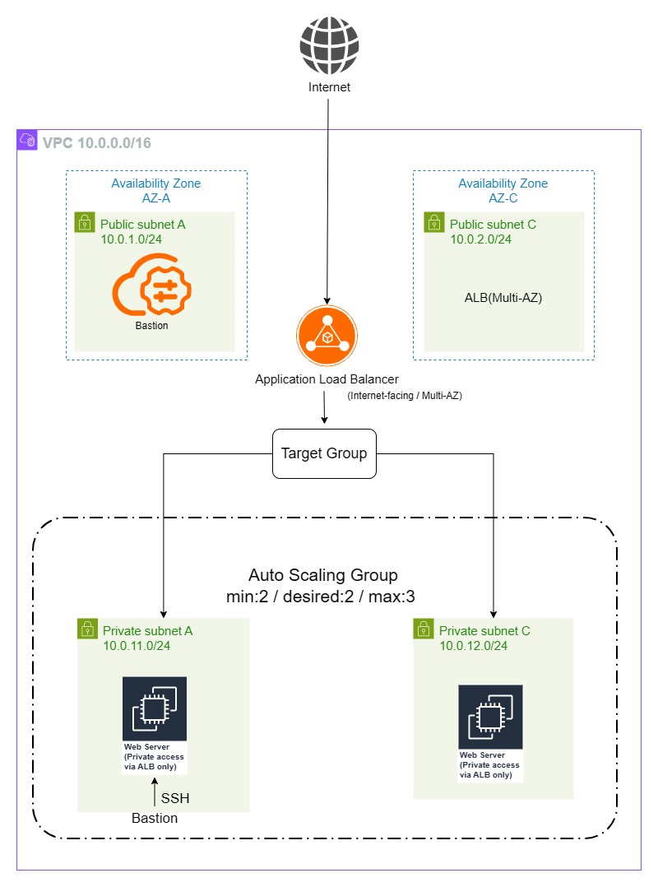

ALBを公開入口とし、EC2はPrivateに配置したAuto Scaling構成

---

## 概要

AWS上にWebサーバー環境を構築し、Application Load Balancer (ALB) を利用してEC2インスタンスへトラフィックをルーティングする構成を作成しました。

セキュリティ設計として、EC2インスタンスにはパブリックIPを付与せず、Security GroupによりHTTP通信はALB経由のみ許可することで、外部からの直接アクセスを制御しています。

また、本構成ではAuto Scaling Group（ASG）を導入し、CloudWatchメトリクス（CPUUtilization）をトリガーとして、負荷に応じてインスタンス数が自動的に増減する仕組みを検証しました。

---


## 使用サービス

- Amazon VPC
- Subnet
- Internet Gateway
- Route Table
- Security Group
- Amazon EC2
- Apache HTTP Server
- Application Load Balancer
- Target Group
- Auto Scaling Group
- Launch Template
- Amazon CloudWatch

---

## ネットワーク構成

### VPC

CIDR

10.0.0.0/16

---

### Public Subnet

10.0.1.0/24  
10.0.2.0/24  

用途:
- ALB配置
- Bastionサーバ配置

Public SubnetはALB用として使用し、  
EC2インスタンスにはパブリックIPを付与していません。

---

### Private Subnet

- EC2（ASG配下）を配置
- パブリックIPなし

外部からの直接アクセスを防ぐため、EC2はPrivateサブネットに配置しています。

本構成では外部通信要件がないため、NAT Gatewayは使用していません。

本検証ではWebサーバの動作確認を目的としているため、
インターネットへのアウトバウンド通信は考慮していません。

---

### Route Table

0.0.0.0/0  
↓  
Internet Gateway  

Public Subnetに対しては、0.0.0.0/0 をInternet Gatewayへルーティングし、
インターネット接続を可能としています。

Private Subnetには直接インターネットへのルートは設定していません。

---

## EC2 Web Server

### インスタンス

- Amazon Linux 2023
- t3.micro

---

### Apacheインストール

- sudo dnf install httpd -y
- sudo systemctl start httpd
- sudo systemctl enable httpd

---

### テストページ

Hello ASG

シンプルなWebコンテンツを配置し、ALB経由での疎通確認および
Auto Scalingによるインスタンス増減時の動作確認を行っています。

---

## Application Load Balancer

### Scheme

Internet-facing

### Listener

HTTP : 80

---

## Target Group

### 基本設定

- Name: portfolio-web-tg
- Protocol: HTTP
- Port: 80
- Target type: Instance

---

### Health Check

- Protocol: HTTP
- Path: /

EC2インスタンスが Healthy 状態であることを確認

---

## Auto Scaling Group

### 設定

- 最小: 2
- 希望: 2
- 最大: 3

---

### 構成

- 起動テンプレート（Launch Template）を使用
- 複数AZにインスタンスを配置（高可用性の確保）

---

### スケーリングポリシー

- メトリクス: CPUUtilization
- ターゲット値: 50%
- ポリシー: Target Tracking

CloudWatchのCPUUtilizationをトリガーとして、
負荷に応じた自動スケーリングを実現しています。

---

### 採用理由

負荷に応じてインスタンス数を自動調整することで、  
可用性の向上とコスト最適化を両立するため

---

## 設計意図

本構成では、以下の点を重視して設計を行いました。

- EC2をPrivateサブネットに配置し、外部公開をALBのみに限定することでセキュリティを確保
- ALBをPublicサブネットに配置し、インターネットからのトラフィックを集約
- 複数AZにリソースを分散し、単一障害点を排除
- Auto Scaling Groupにより負荷に応じたスケーリングを実現し、可用性とコスト最適化を両立
- Bastionサーバを経由したSSH接続により、安全な運用アクセスを確保

---

## セキュリティ設計

### ALB Security Group

- HTTP 80
- Source: 0.0.0.0/0

---

### EC2 Security Group

- SSH 22  
  Source: BastionサーバのSecurity Group

- HTTP 80  
  Source: ALB Security Group

---

### 通信フロー

Internet  
↓  
ALB  
↓  
EC2（Private）

EC2への直接アクセスを防止し、ALB経由のみ通信可能としています。

---

## Bastion構成

踏み台サーバ（Bastion）をPublicサブネットに配置し、  
PrivateサブネットのEC2へはBastion経由でのみSSH接続可能としています。

---

## 動作確認

### ALB DNSへアクセス

http://alb-web-1862903583.ap-northeast-1.elb.amazonaws.com

---

### 表示

Hello ASG

---

## スクリーンショット
以下に、各構成および検証結果のスクリーンショットを示します。

---

### VPC

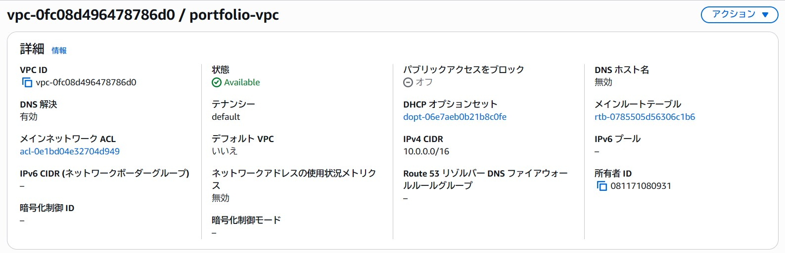

---

### Subnet

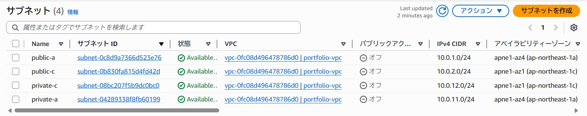

---

### Route Table

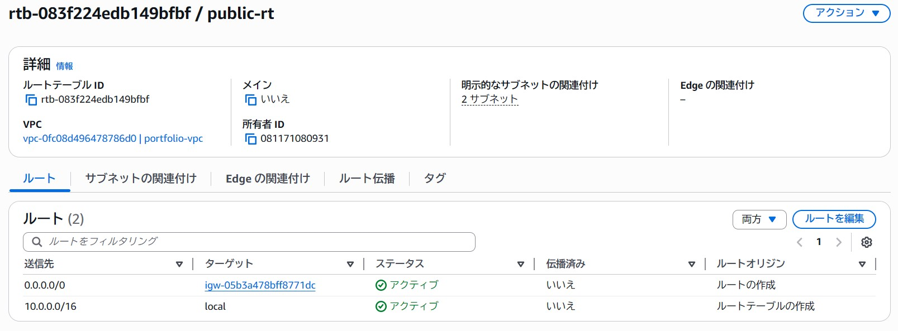

### Route Table Association

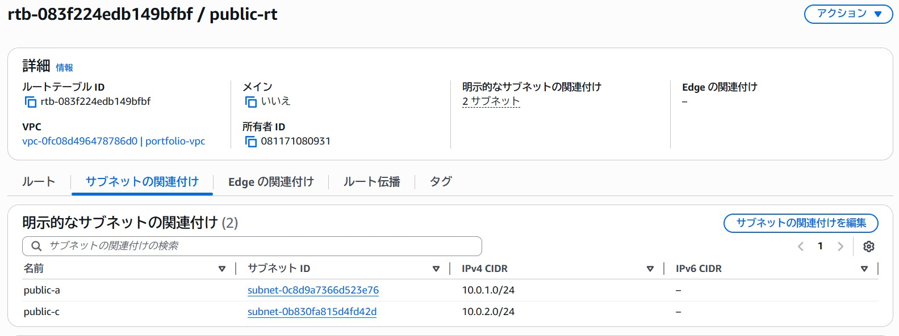

Public Subnetに対してInternet Gatewayへのルートを設定し、
インターネットへのアウトバウンド通信を可能にしています。

---

### Security Group（ALB）

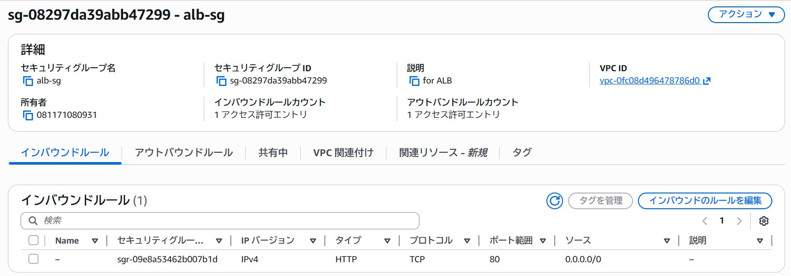


### Security Group（EC2）

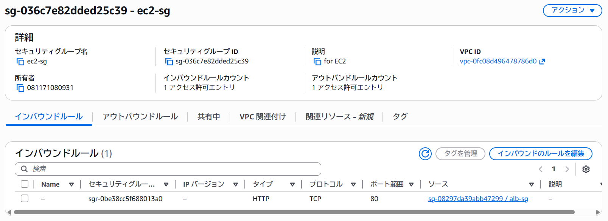

ALBはインターネットからのHTTP通信（80番ポート）を受け付け、
EC2はALBのSecurity Groupからの通信のみを許可しています。

これにより、EC2への直接アクセスを防ぎ、
ALB経由のみの通信経路を実現しています。

---

### Application Load Balancer

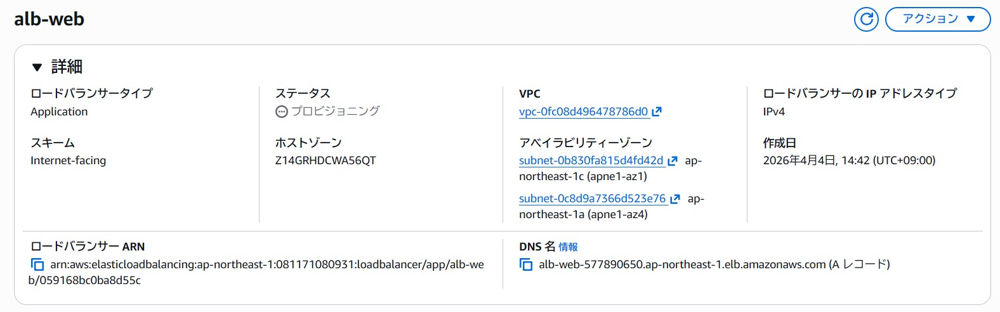

ALBはInternet-facingとして構成し、
複数AZにまたがるサブネットに配置しています。

外部からのHTTPリクエストを受け取り、
Target Groupを通じてEC2へルーティングしています。

---

### Target Group

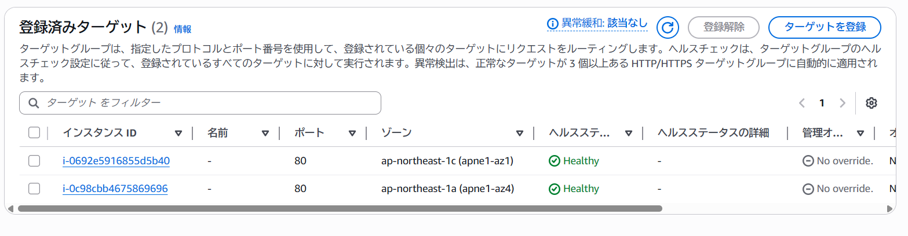

EC2インスタンスが複数AZに分散して登録され、
ヘルスチェックにより正常性が担保されていることを確認

---

### Webアクセス（ALB経由）


---

## Auto Scaling 検証

負荷に応じたスケーリング動作を確認しました。

---

### 負荷発生方法

EC2内部でCPU負荷を発生させて検証を実施

```
yes > /dev/null &
yes > /dev/null &
yes > /dev/null &
```

---

### CPU使用率（トリガー）

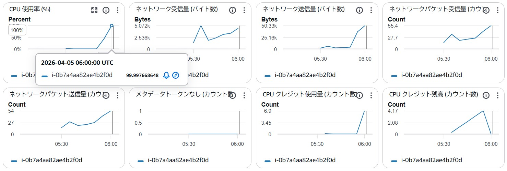

EC2内部でCPU負荷を発生させ、CPUUtilizationの上昇を確認

---

### スケールアウト

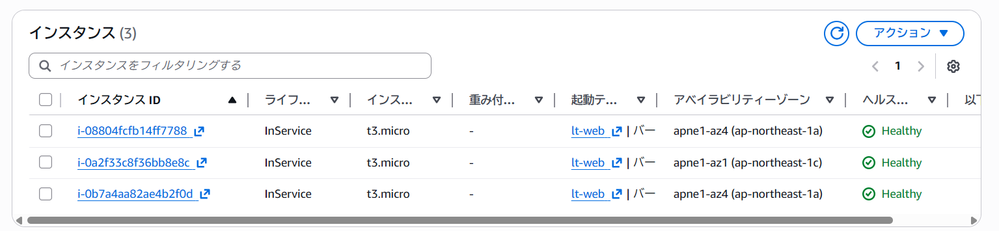

CPU使用率の上昇により、Auto Scaling Groupが動作し  
インスタンス数が **2台 → 3台** に増加したことを確認

---

### Auto Scaling イベント（スケールアウト）

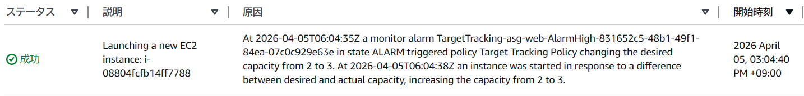

CloudWatchアラーム（Target Trackingポリシー）により  
インスタンスが自動起動されたログを確認

---

### CPU使用率（低下）

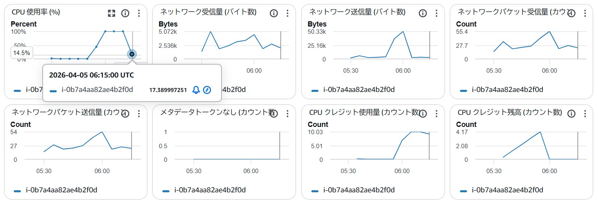

CPU負荷の低下を確認

---

### Auto Scaling イベント（スケールイン）

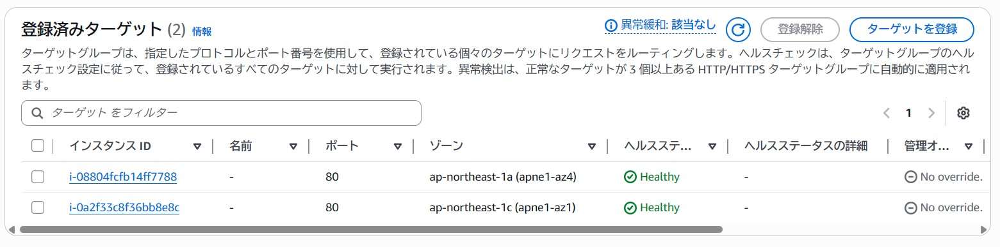

Target Trackingポリシーにより、
インスタンスが自動削除（3台 → 2台）されたことを確認

---

### スケールイン


インスタンス数が3台から2台へ減少したことを確認

---

### Target Group 反映

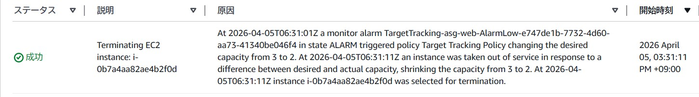

Target Groupからもインスタンスが削除され、
負荷分散対象が減少していることを確認

---

### 検証結果

- CPU上昇 → スケールアウト（2 → 3）
- CPU低下 → スケールイン（3 → 2）

本検証では、CPU使用率をトリガーとしたAuto Scalingの挙動について、
CloudWatchメトリクスの変化、Auto Scaling Groupのインスタンス増減、
およびTarget Groupへのインスタンス登録・削除の各観点から確認を行いました。

特に、スケールアウト時には新規インスタンスが自動的に起動し、
Target Groupへ登録後、ヘルスチェック通過を経てトラフィックが分散されること、
またスケールイン時には対象インスタンスが安全に切り離されることを確認し、
一連のスケーリング動作が正常に機能することを実証しました。

---

## 学び

- VPCを用いたネットワーク設計
- SubnetとRoute Tableの関係
- Internet Gatewayによるインターネット接続
- Application Load Balancerによるトラフィック分散
- Target GroupによるEC2へのルーティング
- ヘルスチェックによるサーバー状態監視
- Security Groupによるアクセス制御
- Auto Scalingによる可用性とコスト最適化
- CloudWatchによるスケーリング制御

---

## 今後の改善

- TerraformによるInfrastructure as Code化
- CloudWatchアラームの詳細設計
- ログ監視（CloudWatch Logs）
